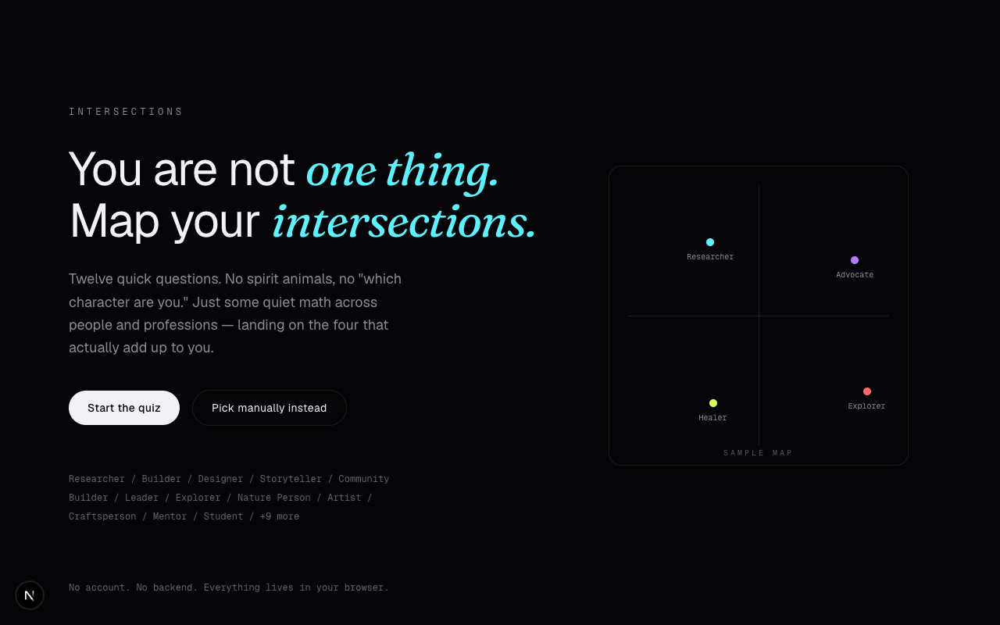

# Intersections

**You are not one thing. Map your intersections.**

A short, sharp identity quiz that finds the four archetypes that actually
describe you — not just for developers and designers, but for researchers,
healers, advocates, teachers, and anyone else who doesn't fit in one box —
and turns them into a shareable, keynote-style positioning chart.



## How it works

1. **Take the quiz** — twelve quick questions build an 8-dimensional trait
   vector (analytical depth, creative expression, technical execution,
   social energy, exploration, leadership, calm under ambiguity, product
   intuition).
2. **Get matched** — a weighted scoring model runs cosine similarity
   against a library of 20+ profession-agnostic archetypes (Researcher,
   Healer, Advocate, Craftsperson, Storyteller, and more), then uses
   Maximal Marginal Relevance to pick four *diverse* matches instead of
   four near-duplicates. Prefer to skip the quiz? Pick your four manually
   from the same library.
3. **Add a photo per intersection** — each upload goes through client-side
   background removal (no server involved) and comes out as a die-cut
   sticker of you. No photo? Generate an icon-based sticker for that
   archetype instead.
4. **Get your map** — a black-background, axis-labeled quadrant chart with
   your four stickers, generated captions, and a center identity
   statement, rendered at high resolution on `<canvas>` and ready to
   download as a PNG or share to LinkedIn.

## Stack

- **Next.js** (App Router) + **TypeScript**
- **Tailwind CSS v4** for styling
- **Framer Motion** for transitions
- **Zustand** (persisted to `localStorage`) for state — no backend, no
  accounts, everything stays in your browser
- **`@imgly/background-removal`** for in-browser photo cutouts
- **HTML Canvas** for the final chart render and PNG export

## Getting started

```bash
npm install
npm run dev
```

Open [http://localhost:3000](http://localhost:3000).

## Project structure

```
src/
  app/                landing, quiz, categories, photos, result pages
  components/         UI primitives, quiz/category/photo/chart components
  lib/
    data/              trait dimensions, category vectors, quiz questions, icons
    algorithm/         cosine similarity + MMR selection, axis labels, quadrant placement, captions
    canvasExport.ts     chart rendering + PNG export
    imageProcessing.ts  background removal + sticker/placeholder generation
  store/               zustand store
```
